# Insurance-Claims-Data-Warehouse
This data warehouse is designed to store and analyze insurance claims data for vehicles that have been serviced at specific branches.
# Data Sources 
The data is a subset of data currently stored in a data warehouse of recorded insurance claims for vehicles that have been serviced at specific branches. The dataset contains information regarding these vehicles (make and model) as well as the different stages each claim goes through for a specific vehicle before the claim is invoiced.

 [Data File](OurData.xlsx)
 # Data Warehouse
1. Which make of vehicle takes longer to be invoiced when being serviced? 
2. Which make of vehicle go through several tests before the invoice can be paid?
3. Which insurance company takes longer to process invoices? 
4. Which insurance companies go through multiple processes before accepting an invoice?

# ETL
## Dimensions :

+ **Dim_Date :** 
  - Date_Key
  - Full_Date : Claim Creation Date
  - Year
  - Month
  - Day
+ **Dim_Outlet :**
  - Outlet_Key
  - Nom : Outlet Name
  - Type : Type of Outlet
  - City : The City where the outlet is situated
  - Province : The province/state where the outlet is situated
+ **Dim_Vehicle :**
  - VE_Key
  - Claim_Vehicle_Year : The year the vehicle was introduced
  - Claim_Vehicle_Make : The make of the vehicle being serviced
  - Claim_Vehicle_Model : The model of the vehicle being serviced
+ **Dim_Assu :**
  - Assu_Key
  - Nom : Insurance Company Name
+ **Dim_Status :**
  - Stat_Key
  - Current_Status : Current Claim Status
  - Current_SubStatus : Current Claim Sub status
## Fact table :
+ **Foreign keys of dimension tables :**
  - Stat_Key
  - Date_Key
  - Assu_Key
  - Outlet_Key
  - VE_Key
+ **KPIs :**
  - Invoice_term : the invoice payment duration
  - NumberOfEvents : the number of events each claim was spent on
  - DurationOfEvents : the duration of all events for which each claim has been
spent

 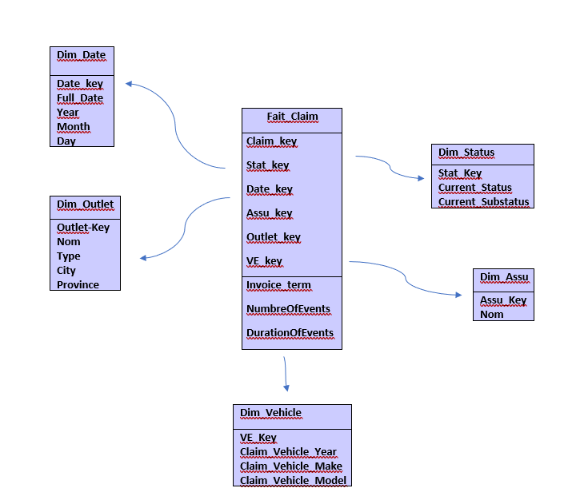
 
 # Tools and Technologies
 + Oracle sql developer
 + Talend : ETL
 + Power BI : Data Visualisation
 # Usage Instructions
 + Import the "project" file into Talend
 # Implementation
 ## Loading data
 + We loaded our Excel file into a database
 
 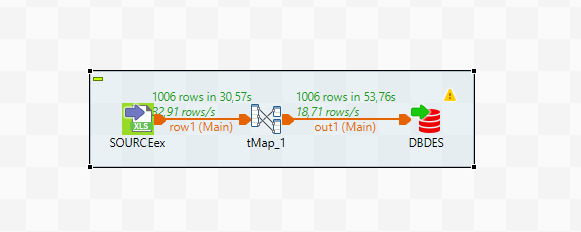
## Dimensions
+ We used COUT_SOURCE as the data source.
+ tUniqRow to eliminate data redundancy.
+ Tmap to map our data.
+ BD_DW as destination.

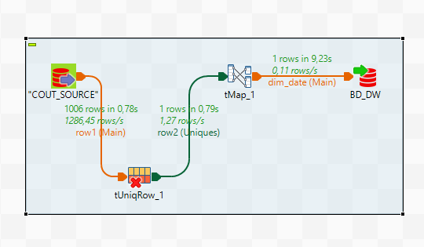

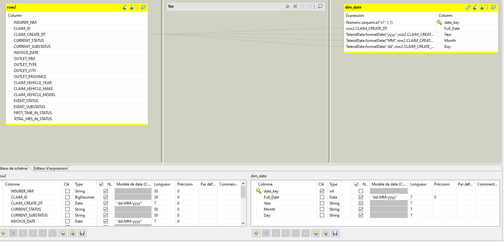
+ **we did the same for the other dimensions.**
## Fact table
+ Before creating the fact table, we created an INFO_DATA table which contains columns that will help us for the creation of this table
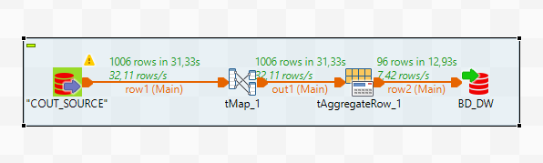
+ We did a groupBy Claim_id and we calculated the sum and count of all rows.
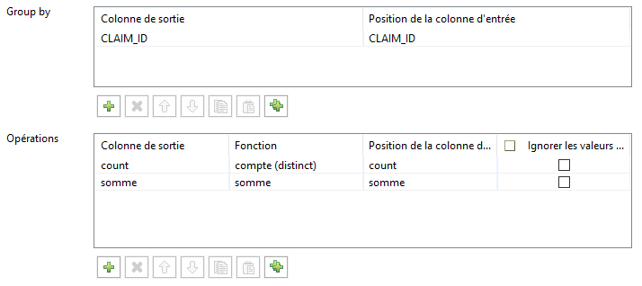

+ Fact table

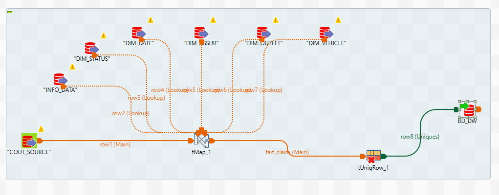

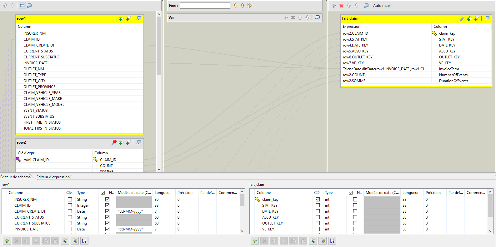
# Visualization
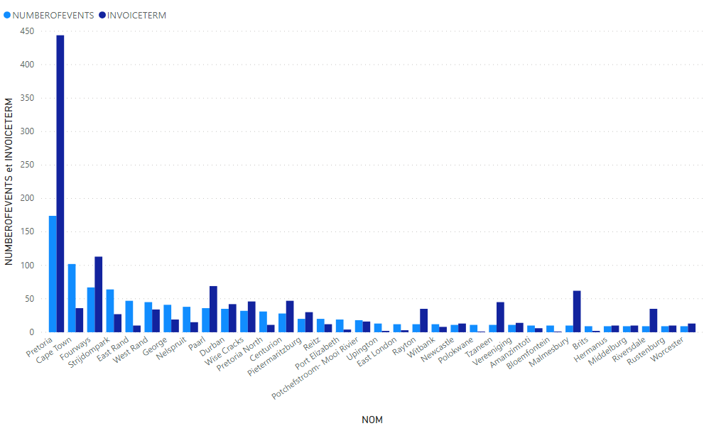
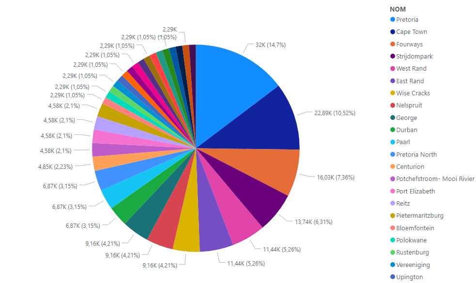
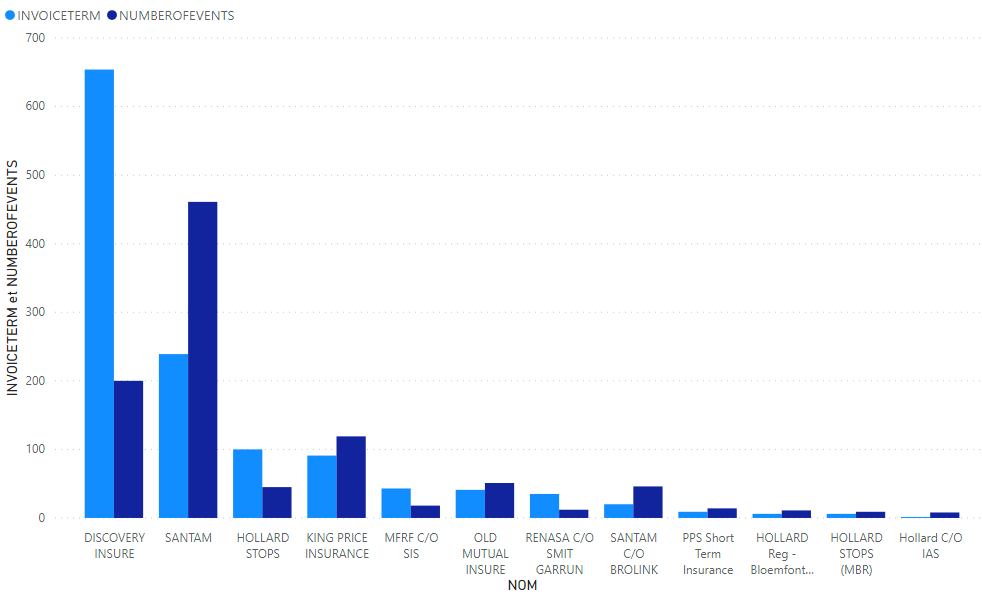
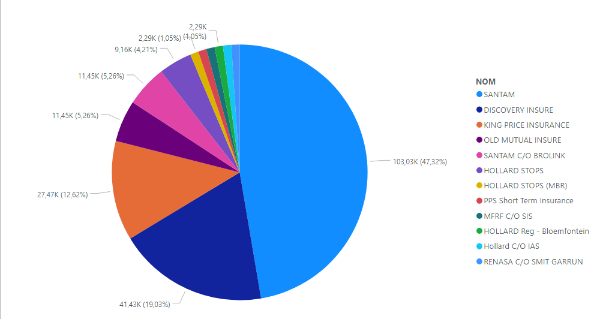
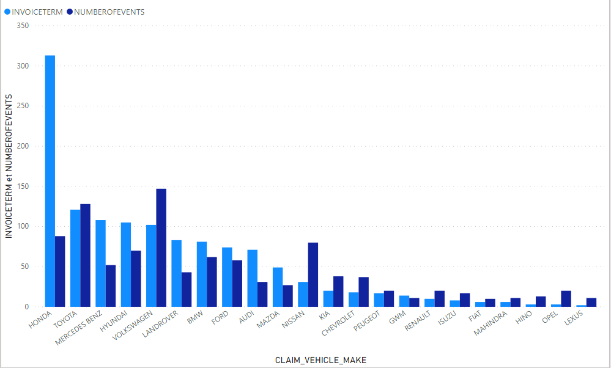
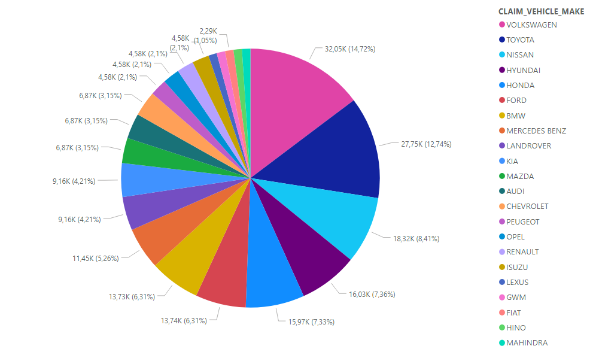

# Contact :busts_in_silhouette:
Feel free to reach out to us if you have any questions or suggestions:

**Chaimae BOUYARMANE**

 

 

 
 
